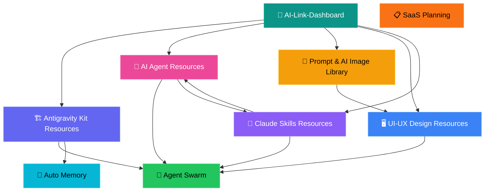

# 🔗 AI-Link-Dashboard

> **Central hub** — Tất cả tài liệu tham khảo, repositories, và tools dùng trong hệ thống LPOpenBIM AI.
> Mỗi mục liên kết tới Obsidian note chi tiết + repo gốc trên GitHub.

---

## 🏗️ 1. Antigravity Kit Ecosystem

> [!info] Core tooling stack cho AI agent development

| # | Tên | GitHub Link | Mô tả | Obsidian Note |
|---|-----|-------------|-------|---------------|
| 1 | **Antigravity Kit** | [vudovn/antigravity-kit](https://github.com/vudovn/antigravity-kit) | Agent scaffold: skills, agents, workflows | [[Antigravity Kit Resources]] |
| 2 | **Superpowers** | [obra/superpowers](https://github.com/obra/superpowers) | Dev workflow skills (brainstorm → verify) | [[Antigravity Kit Resources]] |
| 3 | **InsForge** | [InsForge/InsForge](https://github.com/InsForge/InsForge) | BaaS: DB + Auth + Storage + AI + Functions | [[Antigravity Kit Resources]] |
| 4 | **Antigravity Manager** | [lbjlaq/Antigravity-Manager](https://github.com/lbjlaq/Antigravity-Manager) | Manager tool cho Antigravity sessions | [[Antigravity Kit Resources]] |
| 5 | **Context Hub** | [andrewyng/context-hub](https://github.com/andrewyng/context-hub) | Context window management framework | [[Antigravity Kit Resources]] |
| 6 | **Antigravity Phone Chat** | [krishnakanthb13/antigravity_phone_chat](https://github.com/krishnakanthb13/antigravity_phone_chat) | Phone-based chat interface for Antigravity | [[Antigravity Kit Resources]] |

---

## 🤖 2. System Prompts & AI Agents

> [!info] System prompts, LLM cookbook, và AI agent frameworks

| # | Tên | Link | Mô tả | Obsidian Note |
|---|-----|------|-------|---------------|
| 1 | **Antigravity Fast Prompt** | [system-prompts/.../Fast Prompt.txt](https://github.com/x1xhlol/system-prompts-and-models-of-ai-tools/blob/main/Google/Antigravity/Fast%20Prompt.txt) | System prompt gốc của Antigravity | [[AI Agent Resources]] |
| 2 | **All AI System Prompts** | [x1xhlol/system-prompts-and-models-of-ai-tools](https://github.com/x1xhlol/system-prompts-and-models-of-ai-tools) | Collection: ChatGPT, Claude, Gemini, Copilot | [[AI Agent Resources]] |
| 3 | **OpenAI Cookbook (ChatGPT)** | [openai/openai-cookbook/.../chatgpt](https://github.com/openai/openai-cookbook/tree/main/examples/chatgpt) | Ví dụ ChatGPT chính thức từ OpenAI | [[AI Agent Resources]] |
| 4 | **Awesome LLM Apps** | [Shubhamsaboo/awesome-llm-apps](https://github.com/Shubhamsaboo/awesome-llm-apps) | Bộ sưu tập apps dùng LLM | [[AI Agent Resources]] |

---

## 🎨 3. Prompt & AI Image Generation

> [!info] Thư viện prompts tạo ảnh AI — chủ yếu Nano Banana Pro

| # | Tên | Link | Mô tả | Obsidian Note |
|---|-----|------|-------|---------------|
| 1 | **Awesome Nano Banana Pro** | [muset-ai.github.io](https://muset-ai.github.io/awesome-nano-banana-pro/) | Gallery ảnh + prompts mẫu | [[Prompt & AI Image Library]] |
| 2 | **YouMind Prompts** | [youmind.com](https://youmind.com/vi-VN/nano-banana-pro-prompts) | Prompts tiếng Việt | [[Prompt & AI Image Library]] |
| 3 | **nanobananaprompt.org** | [nanobananaprompt.org](https://nanobananaprompt.org/prompts/) | Prompt library chính thức | [[Prompt & AI Image Library]] |
| 4 | **Skywork Blog** | [skywork.ai](https://skywork.ai/blog/ai-image/nano-banana-pro-prompts/) | Hướng dẫn + tips | [[Prompt & AI Image Library]] |
| 5 | **Picsart** | [picsart.com](https://picsart.com/) | AI image editing & design platform | [[Prompt & AI Image Library]] |

---

## 🖥️ 4. Dashboard & UI/UX Design

> [!info] Design references, component libraries, 3D assets

| # | Tên | Link | Mô tả | Obsidian Note |
|---|-----|------|-------|---------------|
| 1 | **Dribbble Dashboards** | [dribbble.com/search/dashboard](https://dribbble.com/search/dashboard) | Inspiration cho dashboard design | [[UI-UX Design Resources]] |
| 2 | **21st.dev Components** | [21st.dev/community/components](https://21st.dev/community/components) | Community UI components | [[UI-UX Design Resources]] |
| 3 | **UI-UX Pro Max Skill** | [nextlevelbuilder/ui-ux-pro-max-skill](https://github.com/nextlevelbuilder/ui-ux-pro-max-skill) | AI skill cho UI/UX design | [[UI-UX Design Resources]] |
| 4 | **Spline Robot 3D** | [spline.design](https://prod.spline.design/v9YaYVdtQ0VjuFsO/scene.splinecode) | 3D robot chatbot embed | [[UI-UX Design Resources]] |
| 5 | **Stitch Skills** | [google-labs-code/stitch-skills](https://github.com/google-labs-code/stitch-skills) | Google Stitch MCP skills — UI generation | [[UI-UX Design Resources]] |

---

## 🧩 5. Claude & AI Skills

> [!info] Claude Code skills, best practices

| # | Tên | Link | Mô tả | Obsidian Note |
|---|-----|------|-------|---------------|
| 1 | **Awesome Claude Skills** | [BehiSecc/awesome-claude-skills](https://github.com/BehiSecc/awesome-claude-skills) | Bộ sưu tập skills cho Claude | [[Claude Skills Resources]] |
| 2 | **Claude Best Practice** | [shanraisshan/claude-code-best-practice](https://github.com/shanraisshan/claude-code-best-practice) | Coding best practices với Claude | [[Claude Skills Resources]] |
| 3 | **Gemini King Mode** | [aicodeking/yt-tutorial/gemini-king-mode.md](https://github.com/aicodeking/yt-tutorial/blob/main/gemini-king-mode.md) | ULTRATHINK protocol + Intentional Minimalism | [[Claude Skills Resources]] |

---

## 📊 Thống Kê

| Danh mục | Số links | Obsidian Notes liên kết |
|----------|----------|------------------------|
| Antigravity Kit | 6 | [[Antigravity Kit Resources]] |
| System Prompts & AI | 4 | [[AI Agent Resources]] |
| Image Prompts | 5 | [[Prompt & AI Image Library]] |
| UI/UX Design | 5 | [[UI-UX Design Resources]] |
| Claude Skills | 3 | [[Claude Skills Resources]] |
| **Tổng** | **23** | **5 notes** |

---

## 🕸️ Graph Connections

## Links

- [[AGENT_SWARM|← Agent Swarm MOC]]
- [[Vault Dashboard|📊 Vault Dashboard]]
- [[Session Dashboard|📋 Session Dashboard]]
- [[Auto Memory|🧠 Auto Memory]]
