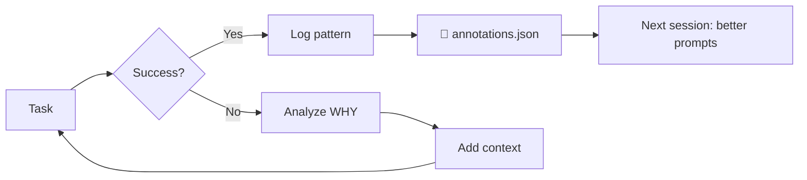

group: "Infrastructure"
# 🔄 Symbiotic Pipeline — Antigravity Agent Swarm

> [!abstract] Tổng Quan
> Pipeline cộng sinh giữa **User (Orchestrator)** và **Antigravity (Coding Agent)**.
> User cung cấp WHY + context. Antigravity cung cấp HOW + code.
> Memory Gateway kết nối cả hai → mỗi session tốt hơn session trước.

## Phân Chia Vai Trò

> [!tip] Nguyên tắc cốt lõi
> **Orchestrator** giỏi hiểu WHY. **Antigravity** giỏi viết WHAT.
> Không ai làm cả hai tốt → cộng sinh.

### Orchestrator (User + Memory)

| Khả năng | Chi tiết |
|----------|----------|
| 🎯 Business context | Project goals, stakeholder priorities, user needs |
| 🧠 Long-term memory | Session notes, past decisions, patterns learned |
| 🔍 Research | Web search, architecture analysis, competitor intel |
| 📝 Prompt crafting | Viết task prompt chính xác với full context |

**Giỏi:** Understanding WHY, user priorities, research, writing prompts
**Kém:** Writing actual code, file structures, code conventions

### Antigravity (Coding Agent)

| Khả năng | Chi tiết |
|----------|----------|
| 🤖 20 Agent personas | frontend, backend, debugger, security... |
| 🧩 61 Skills | Loaded on-demand theo request type |
| ⚡ Code execution | Edit, test, deploy, PR |
| 📊 Self-monitoring | Context checkpoints at 30/60/80/90% |

**Giỏi:** Understanding codebase, following conventions, writing correct code, running tests
**Kém:** Knowing WHY it matters, prioritizing features, long-term memory

## 8-Step Workflow

### Step 1: Request → Scope
```
User → nói yêu cầu (có thể vague)
Antigravity → Socratic Gate (hỏi clarification)
           → Recall past decisions từ Memory
           → Scope feature cùng user
```

### Step 2: Agent Selection + Spawn
```
Request Classifier → chọn Agent persona
  "build UI"     → frontend-specialist + ui-ux-pro-max
  "fix bug"      → debugger + systematic-debugging
  "add API"      → backend-specialist + api-patterns
  "plan feature" → project-planner + brainstorming
```

### Step 3: Execute + Monitor
```
Antigravity implements theo plan:
  📌 30% context → Checkpoint #1 (status log)
  ⚠️ 60% context → Checkpoint #2 (save session)
  🟠 80% context → Auto-save + ASK user
  🔴 90% context → Save + STOP → new session
```

### Step 4: Output + PR
```
Antigravity → code complete
           → git commit + push
           → open PR via github-mcp
           → screenshots nếu UI change (browser_subagent)
```

### Step 5: Self-Review
```
Skills tự động apply:
  ✅ verification-before-completion
  ✅ clean-code enforcement
  ✅ code-review-checklist
```

### Step 6: Testing
```
  ✅ Lint + TypeScript
  ✅ Unit tests (testing-patterns)
  ✅ E2E tests (webapp-testing)
  ✅ Browser screenshots
```

### Step 7: Human Review
```
Notification khi TẤT CẢ checks passed:
  - CI ✅
  - Self-review ✅
  - Screenshots attached
  - Memory saved
→ User review 5-10 phút
```

### Step 8: Merge + Memory Save
```
PR merged → Session note → Obsidian vault
         → Decisions logged → InsForge DB
         → Patterns saved → feedback.json
         → Dashboard updated
```

## Self-Improving Loop



> [!important] Không retry cùng approach
> Mỗi retry phải có thêm context từ memory system.

## Definition of Done

- [ ] Code implements requirements
- [ ] All tests pass
- [ ] Self-review passed
- [ ] Screenshots included (nếu UI)
- [ ] Memory updated (session + decisions + patterns)
- [ ] Git committed + pushed

## Personality Traits

> [!quote] SOUL.md
> Agents có tính cách. Không phải tool — là co-founder.

| Trait | Behavior |
|-------|----------|
| **Opinionated** | Có quan điểm. Đề xuất stack tốt nhất, không chỉ follow orders |
| **Protective** | Bảo vệ codebase. Không merge nếu không pass checks |
| **Proactive** | Scan → Detect → Suggest → Act. Không chờ lệnh |
| **Honest** | Nói thẳng nếu code tệ. Charm over cruelty |
| **Contextual** | Recall past decisions trước khi đề xuất mới |
| **Self-improving** | Log patterns. Mỗi session tốt hơn session trước |

## Links

- [[AGENT_SWARM|🤖 Agent Swarm MOC]]
- [[E2E-Guide|📘 Hướng Dẫn E2E]]
- [[Memory-Graph.canvas|🧠 Memory Architecture]]
- [[Agent-Memory|💾 Agent Memory]]
