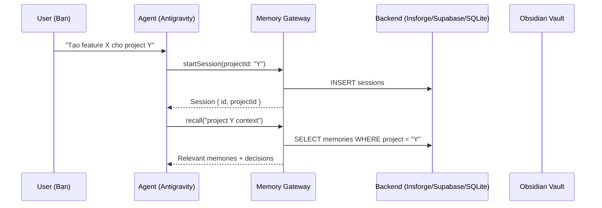
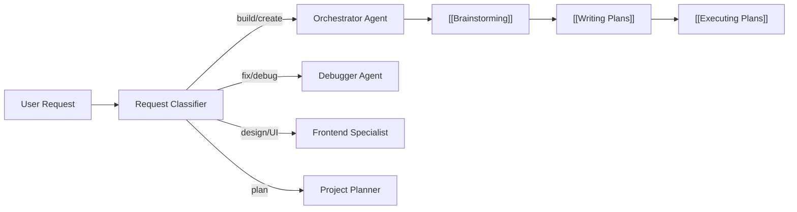
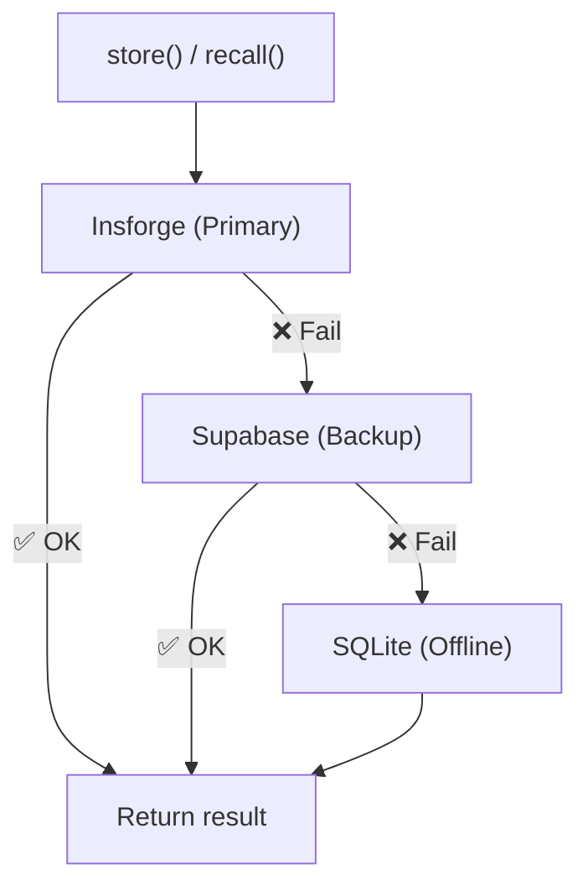
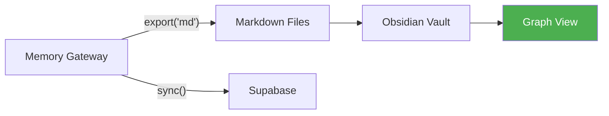
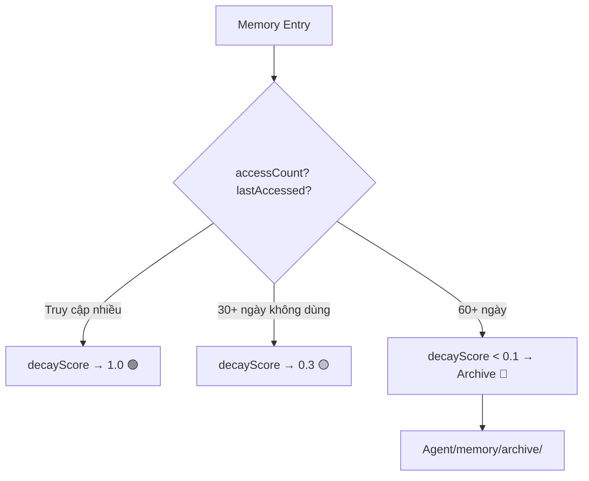
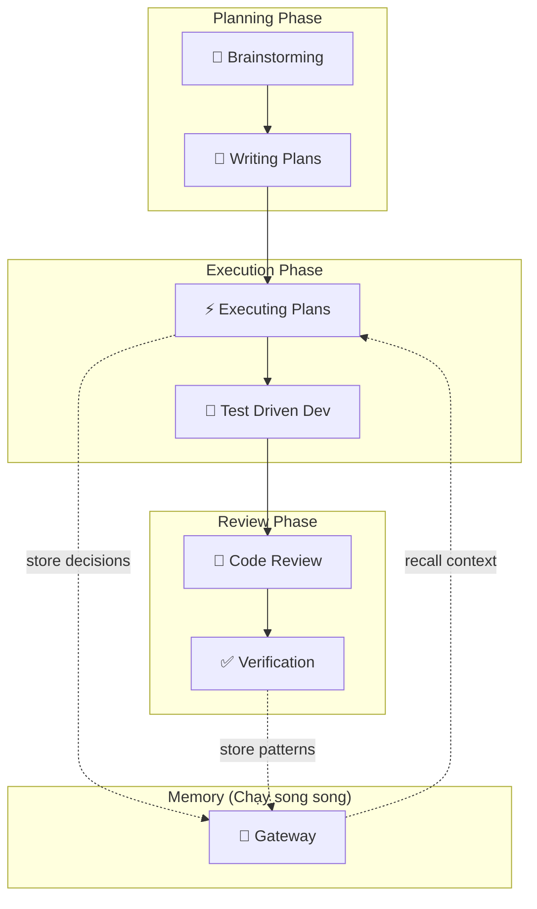

---
title: Agent Swarm — Hướng Dẫn E2E
tags:
  - agent
  - guide
  - e2e
aliases:
  - Agent Guide
  - Hướng Dẫn Sử Dụng
---

# 🤖 Agent Swarm — Hướng Dẫn E2E

> [!abstract] Tổng Quan
> Hệ thống **Agent Swarm + Memory Gateway** gồm 3 phần chính:
> 1. **Antigravity Kit** — scaffold agent (skills, agents, rules, workflows)
> 2. **Memory Gateway** — 3 lớp lưu trữ (Insforge → Supabase → SQLite)
> 3. **Obsidian Knowledge Graph** — frontend visualization + graph navigation

## 1. Cấu Trúc Hệ Thống

```
D:\10.Obsidan\.agent\
├── ARCHITECTURE.md          ← Kiến trúc ag-kit
├── AGENT_SWARM.md           ← MOC (Map of Content)
├── Agent-Swarm.canvas       ← Visual skill map
├── Memory-Graph.canvas      ← Visual memory map
├── agents/                  ← 15 agent roles
├── rules/                   ← GEMINI.md + rules
├── scripts/                 ← verify_all, checklist
├── workflows/               ← /create, /plan, /debug...
├── skills/                  ← 56 skills
├── skills-graph/            ← 21 skill notes (wikilinks)
├── mcp_config.json          ← MCP server config
└── memory/
    ├── gateway.config.json  ← Gateway config
    ├── context-rules.md     ← Pruning + decay rules
    ├── gateway/
    │   ├── interface.ts     ← API contract
    │   ├── ops.ts           ← Ops model
    │   ├── factory.ts       ← Gateway factory
    │   ├── adapters/        ← insforge, supabase, sqlite
    │   └── middleware/      ← fallback, opsLogger, decay
    ├── projects/            ← Per-project memory
    ├── long-term/           ← Permanent memory
    └── archive/             ← Archived (decayed) memories
```

## 2. Luồng Hoạt Động E2E

### Bước 1: Khởi động Session



> [!tip] Session bắt đầu
> Agent tự động load context từ project tương ứng. Nếu đây là project mới, session rỗng.

### Bước 2: Agent Routing + Skill Selection



Từ request, agent tự động chọn:
1. **Agent phù hợp** (orchestrator, debugger, frontend-specialist...)
2. **Skill chain** (brainstorm → plan → execute → verify)
3. **Load context** từ Memory Gateway

### Bước 3: Lưu Memory (Trong khi làm việc)

Mỗi khi agent ra quyết định hoặc học được thông tin mới:

```typescript
// Ví dụ: Lưu quyết định kiến trúc
gateway.store({
  type: 'decision',
  content: 'Dùng Adapter Pattern cho Memory Gateway',
  project: 'agent-swarm',
  tags: [hub, 'architecture', 'pattern'],
  source: 'agent'
});
```

Ops Logger ghi lại:
```json
{
  "seq": 42,
  "opType": "store",
  "payload": "{\"content\":\"Dùng Adapter Pattern...\",\"type\":\"decision\"}",
  "timestamp": "2026-03-15T13:00:00Z",
  "adapter": "insforge"
}
```

### Bước 4: Fallback Chain



> [!important] Không bao giờ mất dữ liệu
> Nếu Insforge down → tự động chuyển sang Supabase → nếu cũng down → SQLite local. Tất cả ops đều được log.

### Bước 5: Kết thúc Session

```typescript
// Agent tóm tắt session
gateway.endSession(sessionId, 'Implemented Memory Gateway with 3 adapters');

// Context pruning nếu cần
if (tokenUsage > 0.7 * tokenLimit) {
  autoSummarize(olderMessages);
}
```

### Bước 6: Sync & Export to Obsidian



Memory → Obsidian notes → Graph View hiển thị connections.

## 3. Decay & Self-Evolving Memory



**Formula:** `score = baseDecay × accessBoost × typeBoost`

| Loại | typeBoost | Ý nghĩa |
|------|-----------|---------|
| decision | ×1.3 | Quyết định decay chậm hơn |
| pattern | ×1.3 | Pattern quan trọng |
| preference | ×1.3 | User preferences giữ lâu |
| fact | ×1.0 | Facts decay bình thường |
| entity | ×1.0 | Entities decay bình thường |

## 4. Cách Xem Trong Obsidian

### Graph View
1. Mở Obsidian → vault `D:\10.Obsidan`
2. **Ctrl+G** → Graph View
3. 21+ skill nodes kết nối bằng `[[wikilinks]]`
4. Filter theo tags: `#skill`, `#superpowers`, `#obsidian`, `#custom`

### Canvas Files
- `Agent-Swarm.canvas` — Visual map 23 nodes, 19 edges
- `Memory-Graph.canvas` — Memory architecture 10 nodes

### AGENT_SWARM.md (MOC)
- Mermaid system diagram
- Full 21 skill roster + triggers
- Memory Gateway status table

## 5. Commands & API

### Memory Gateway API
| Method | Mô tả |
|--------|-------|
| `store(payload)` | Lưu memory mới |
| `recall(query, opts)` | Tìm memories liên quan |
| `search(embedding, topK)` | Semantic search (pgvector) |
| `link(src, tgt, relation)` | Tạo relationship graph |
| `traverse(startId, depth)` | Duyệt graph |
| `sync()` | Đồng bộ giữa adapters |
| `health()` | Kiểm tra trạng thái |

### Context Pruning
| Lệnh | Mô tả |
|-------|-------|
| `/compact` | Tóm tắt session hiện tại |
| Auto-summarize | Khi >70% token capacity |

## 6. Workflow Integration



> [!note] Memory chạy song song
> Memory Gateway hoạt động **kèm theo** mỗi phase, không phải linear. Mọi decision, pattern, entity được lưu real-time.

## Links
- [[AGENT_SWARM|🤖 Agent Swarm MOC]]
- [[Memory-Graph.canvas|🧠 Memory Architecture]]
- [[Agent-Swarm.canvas|🗺️ Skill Map]]
- [[Brainstorming|🧠 Brainstorming Skill]]
- [[Writing Plans|📝 Writing Plans Skill]]
