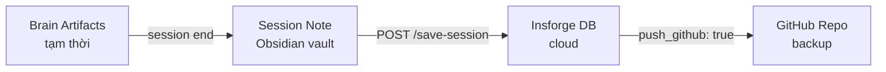

group: "Guides & Setup"
# 🧠 Antigravity Artifacts — Tổng Quan

> [!info] Tổng quan
> Antigravity (AI coding assistant) tạo 2 loại file: **rules** (AI agent phải tuân theo) và **brain artifacts** (tạm thời theo phiên làm việc).

## 📜 GEMINI.md — AI Rules File

File quy tắc bắt buộc cho Antigravity. Có 2 cấp:

| File | Scope | Vị trí |
|------|-------|--------|
| **Global** | Mọi workspace | `{user_home}/.gemini/GEMINI.md` |
| **Workspace** | Chỉ project hiện tại | `.agent/rules/GEMINI.md` |

> Workspace GEMINI.md nằm trong vault tại `.agent/rules/GEMINI.md` — AI agent tự đọc file này.

### Nội dung chính:

| Section | Mô tả |
|---------|--------|
| **TIER 0** | Universal rules: Clean Code, Agent Routing, Language Handling |
| **Auto-Memory Lifecycle** | Session start → checkpoint (30/60/80/90 tool calls) → save khi done |
| **TIER 1** | Code rules: Project routing, Socratic Gate, Final Checklist |
| **TIER 2** | Design rules (reference tới agent files) |

> Auto-Memory nằm trong **cả** Global + Workspace GEMINI.md → không bao giờ bị mất kể cả khi context truncated.

## 📁 Brain Artifacts — Tạm Thời

Mỗi phiên làm việc, Antigravity tạo artifacts tạm trong thư mục `brain/`:

```
{user_home}/.gemini/antigravity/brain/
├── {conversation-id}/
│   ├── task.md                # Task checklist
│   ├── implementation_plan.md # Kế hoạch thực thi
│   ├── walkthrough.md         # Bản tổng kết sau hoàn thành
│   └── *.png / *.webp         # Screenshots, recordings
```

> [!warning] Chỉ có trên máy local
> Brain artifacts là **tạm thời, local**, không sync được giữa các máy. Nội dung quan trọng được tổng hợp vào session note trong Obsidian.

## Mối liên hệ với Auto-Memory

| Layer | Vị trí | Mục đích | Tính chất |
|-------|--------|----------|-----------|
| Brain Artifacts | `{user_home}/.gemini/antigravity/brain/` | Artifacts tạm thời theo conversation | ⏳ Tạm thời, local |
| [[Agent-Memory]] | `LPOpenBIMAI/Agent-Memory/` | Session notes lâu dài | ✅ Persistent, trong Vault |
| Insforge DB | Cloud | Memories, entities, relationships | ☁️ Cloud, cross-device |
| GitHub | Remote | Backup + sync | 🔄 Remote backup |

## Flow: Artifacts → Session Notes



1. Khi session kết thúc → nội dung quan trọng từ brain artifacts được tổng hợp vào session note
2. Session note push lên [[Agent-Memory]] → Insforge DB → GitHub
3. Conversation tiếp theo auto-load từ DB, không cần đọc lại brain artifacts cũ

## Checkpoint Protocol (tóm tắt)

Mỗi checkpoint và session end, AI agent PHẢI:

| Bước | Hành động |
|------|-----------|
| 1 | Append rows vào bảng **User Query Log** |
| 2 | Update bảng **Decision Log** nếu có decision mới |
| 3 | Update section **Conversations** |
| 4 | POST `/mem-gw-final/save-session` với `push_github: true` |

> Chi tiết đầy đủ trong `.agent/rules/GEMINI.md` section "Auto-Memory Lifecycle" và `.agent/skills/auto-memory/SKILL.md`.

## Links

- [[GEMINI Rules|GEMINI Rules (AI Config)]]
- [[Agent-Memory|Memory Hub]]
- [[Auto Memory|Auto-Memory Skill]]
- [[memory-config|Memory Config]]
- [[Antigravity Kit|Platform Hub]]
