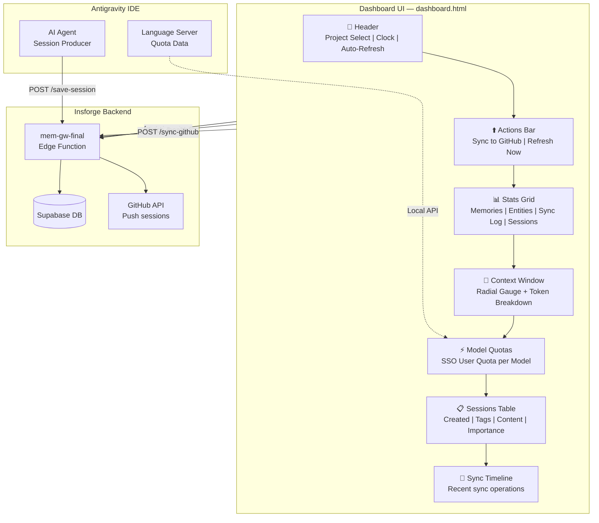
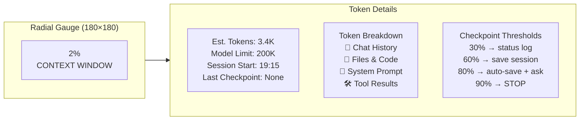

---
tags:
  - tool
  - dashboard
  - memory
  - auto-memory
  - context-window
created: 2026-03-15
updated: 2026-03-15
status: active
type: system-tool
group: Agent Memory
---

# Memory Context Monitor

> Dashboard UI cho hệ thống Auto-Memory — theo dõi sessions, context window, model quotas, và sync status theo thời gian thực.

**URL:** `http://127.0.0.1:8484/dashboard.html`
**Source:** `LPOpenBIMAI/Agent-Memory/dashboard.html`
**Tech:** Vanilla HTML + CSS + JS (single file, no build)
**Backend:** Insforge Edge Function `mem-gw-final`

---

## 🏗️ Architecture

---

## 📐 UI Sections (Top → Bottom)

### 1. Header
| Element | Mô tả |
|---------|--------|
| Logo + Title | "Memory Context Monitor v2.0" |
| Project Select | Dropdown chọn project (LPOpenBIMAI, 10.Obsidan, ...) |
| Clock | Real-time clock (HH:MM:SS) |
| Auto-Refresh Toggle | ON/OFF auto-refresh mỗi 30s |

### 2. Actions Bar
- **Sync to GitHub** — POST `/mem-gw-final/sync-github` → push session notes lên GitHub repo
- **Refresh Now** — Reload toàn bộ data (sessions, health, syncs)

### 3. Stats Grid (4 cards)

| Card | Metric | Source |
|------|--------|--------|
| 💾 Memories | Tổng memories (long-term + decisions) | `/health` → `total_memories` |
| 🔗 Entities | Projects, tools, concepts | `/health` → `total_entities` |
| 🔄 Sync Log | Tổng sync operations | `/health` → `sync_operations` |
| 📂 Sessions | Sessions cho project đã chọn | `/sessions?project=X` |

### 4. Context Window

#### Cách tính Token
| Component | Estimation | Default |
|-----------|-----------|---------|
| System Prompt | Fixed overhead (GEMINI.md + rules) | ~2,000 tokens |
| Chat History | `sessionContent.length / 4 × 4` | Variable |
| Files & Code | File references × 800 tokens/file | Variable |
| Tool Results | Tool calls × 1,200 tokens/call | Variable |
| **Total** | Sum → % of model limit | 200K (Sonnet 4.5) |

#### Model Limits (2026)
| Model | Context Window | Pricing |
|-------|---------------|---------|
| Claude Opus 4.6 | **1M tokens** (beta) | $10/$37.50 per 1M (>200K) |
| Claude Sonnet 4.5 | **200K tokens** | $5/$25 per 1M |
| GPT-5.2 | 400K | — |
| Gemini 3 Pro | 1M | — |

### 5. Model Quotas ⚡

Hiển thị **SSO user quota** cho từng AI model trong Antigravity IDE:

| Model | Tier | Usage | Reset |
|-------|------|-------|-------|
| Gemini 3.1 Pro | High | 100.0% | ~5h |
| Gemini 3.1 Pro | Low | 100.0% | ~5h |
| Gemini 3 Flash | High | 100.0% | ~5h |
| Claude Sonnet 4.6 | Thinking | 60.0% | ~2h |
| Claude Opus 4.6 | Thinking | 60.0% | ~2h |
| GPT-OSS 120B | Medium | 60.0% | ~2h |

**Color coding:**
- 🟢 Green: >50% remaining
- 🟡 Yellow: 20-50% remaining
- 🔴 Red: <20% remaining

### 6. Sessions Table
| Column | Mô tả |
|--------|--------|
| Created | Timestamp tạo session |
| Tags | Project tags (e.g., `LPOpenBIMAI`, `antigravity`) |
| Content | Session summary (truncated) |
| Importance | Priority level |

### 7. Sync Timeline
Timeline hiển thị các sync operations gần đây (GitHub push, checkpoint saves, etc.)

---

## 🎨 Design System

| Property | Value |
|----------|-------|
| Theme | Dark glassmorphism |
| Background | `#0a0e1a` (deep navy) |
| Glass effect | `rgba(255,255,255,0.03)` + backdrop-blur |
| Border | `rgba(255,255,255,0.06)` |
| Accent Cyan | `#00e5ff` |
| Accent Green | `#00e676` |
| Accent Yellow | `#ffd600` |
| Accent Red | `#ff5252` |
| Font Primary | `Inter` |
| Font Mono | `JetBrains Mono` |
| Animations | `fade-up` entrance, cubic-bezier transitions |

---

## 🔗 API Endpoints

| Endpoint | Method | Mô tả |
|----------|--------|--------|
| `/health` | GET | Dashboard stats (memories, entities, syncs) |
| `/sessions` | GET | List all sessions |
| `/sessions?project=X` | GET | Sessions filtered by project |
| `/save-session` | POST | Save session note (from agent) |
| `/sync-github` | POST | Trigger GitHub push |
| `/context-stats` | GET | Context usage statistics |

**Base URL:** `https://4ian5xm8.functions.insforge.app/mem-gw-final`

---

## 🔧 Connections

- [[Auto-Memory]] — Protocol that produces session data consumed by dashboard
- [[Insforge SDK]] — Backend platform hosting the edge function
- [[GEMINI.md]] — Defines checkpoint thresholds (30/60/80/90%)
- [[Agent Memory E2E Guide]] — Full system architecture documentation
- [[Memory Graph]] — Knowledge graph visualization

---

## 📝 Changelog

| Date | Change |
|------|--------|
| 2026-03-15 | Added Context Window with token-based calculation |
| 2026-03-15 | Added Token Breakdown visualization (Chat/Files/System/Tools) |
| 2026-03-15 | Updated MODEL_LIMITS with 2026 Anthropic specs |
| 2026-03-15 | Added Model Quotas panel (SSO user quota per model) |
| 2026-03-15 | Created this documentation note |
