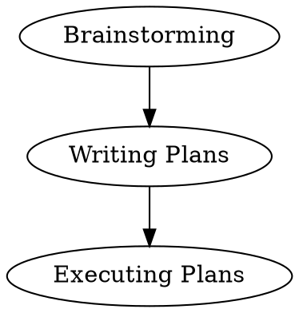

# Graphviz

> [!tip] Plugin
> Render Graphviz DOT diagrams trực tiếp trong notes.

## Quick Start
````markdown

````

## Agent Swarm Usage
- Vẽ workflow diagrams trực tiếp trong notes
- Visualize agent routing paths
- Custom architecture diagrams

> [!info] Xem chi tiết
> Hướng dẫn đầy đủ trong [[System-Guide#Graphviz|System Guide § Graphviz]]

## See Also
- [[Lovely Mindmap]] — Heading → mindmap
- [[AGENT_SWARM|Agent Swarm MOC]]
