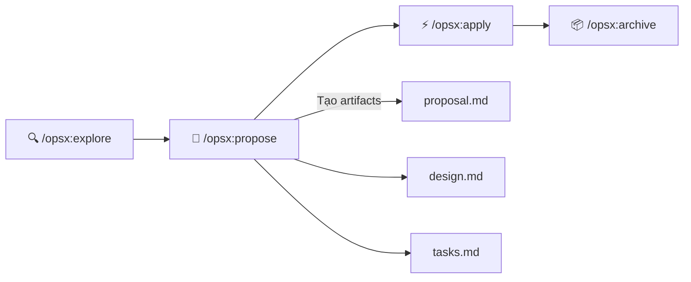

# 📋 OpenSpec — Spec-Driven Development

> Agree before you build — human & AI align on specs before code.

## Tổng Quan

**OpenSpec** = lightweight spec layer cho AI coding assistants. Thay vì requirements chỉ nằm trong chat history, OpenSpec tạo cấu trúc rõ ràng:

```
proposal → specs → design → tasks → implement
```

## Cài Đặt

```powershell
# Install global
npm install -g @fission-ai/openspec@latest

# Init trong project (đã init cho workspace này)
openspec init --tools "antigravity,claude,cursor,gemini" .

# Update khi có version mới
openspec update
```

## Slash Commands

| Command | Mô tả | Khi nào dùng |
|---------|--------|-------------|
| `/opsx:propose` | Tạo change + generate proposal, design, tasks | Bắt đầu feature mới |
| `/opsx:apply` | Implement tasks từ change | Sau khi approve proposal |
| `/opsx:explore` | Explore mode — suy nghĩ, khảo sát | Khi chưa rõ requirements |
| `/opsx:archive` | Archive change hoàn thành | Khi feature xong |

## Workflow



## Cấu Trúc Files

```
openspec/
├── changes/           ← Mỗi change = 1 folder
│   └── <change-name>/
│       ├── .openspec.yaml
│       ├── proposal.md    ← What & Why
│       ├── design.md      ← How
│       └── tasks.md       ← Implementation steps
└── specs/             ← Accumulated specs
```

## CLI Commands

| Command | Mô tả |
|---------|--------|
| `openspec list` | Liệt kê changes |
| `openspec status` | Trạng thái artifacts |
| `openspec view` | Interactive dashboard |
| `openspec validate` | Validate specs/changes |
| `openspec show <name>` | Xem change cụ thể |
| `openspec schemas` | Xem workflow schemas |

## Mapping với Antigravity Skills

| OpenSpec Phase | Antigravity Skill | So sánh |
|---------------|-------------------|---------|
| `/opsx:explore` | [[Brainstorming]] | Cả hai: khảo sát ý tưởng trước khi code |
| `/opsx:propose` | [[Writing Plans]] | Propose → plan; design → architecture |
| `/opsx:apply` | [[Executing Plans]] | Implement từ plan/tasks |
| `/opsx:archive` | [[Finishing Dev Branch]] | Cả hai: finalize + cleanup |
| `proposal.md` | `implementation_plan.md` | Tương đương goal + context |
| `design.md` | Architecture section | Tương đương technical approach |
| `tasks.md` | `task.md` checklist | Tương đương task breakdown |

## So Sánh với Các Tool Khác

| Feature | OpenSpec | Spec Kit | Kiro (AWS) |
|---------|---------|----------|------------|
| Weight | Lightweight | Heavyweight | IDE-locked |
| Phase gates | Fluid, no rigid gates | Rigid | Rigid |
| AI tools | 20+ (Antigravity, Claude, Cursor...) | Limited | Claude only |
| Iteration | Update anytime | Linear | Linear |
| Setup | `npm install -g` | Python | IDE install |

## Tips

> [!tip] Best Practices
> - Dùng **high-reasoning models** (Opus 4.5, GPT 5.2) cho planning
> - **Clear context** trước khi `apply` — context sạch = code tốt
> - Mỗi change nên focused — 1 feature/fix per change

> [!note] Kết hợp OpenSpec + Antigravity
> OpenSpec tạo spec layer → Antigravity execute code.
> Flow: `/opsx:explore` → `/opsx:propose` → review → `/opsx:apply` (Antigravity runs)

## Links

- [GitHub Repo](https://github.com/Fission-AI/OpenSpec)
- [[AGENT_SWARM|← Agent Swarm MOC]]
- [[SaaS Planning Workflow|SaaS Planning]]
- [[Antigravity Kit Resources|Antigravity Kit]]
- [[AI Agent Resources|AI Agent Docs]]
