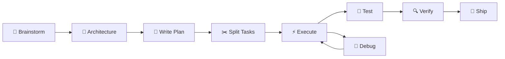

# 📐 SaaS Planning Workflow

> Quy trình lập kế hoạch production-ready SaaS app với AI agents.

## Phase 1: Plan

> Create a full implementation plan for a production-ready SaaS app

Break work into:
- Architecture decisions
- Backend service
- Frontend service
- Database schema
- API contracts
- Deployment pipeline, workflow, dataflow

## Phase 2: Convert → Tasks

> Convert this plan into executable engineering tasks

Each task should:
- ✅ Affect limited files
- ✅ Be independently testable
- ✅ Include acceptance criteria

## Deliverables

| Artifact | Mô tả |
|----------|--------|
| `architecture.md` | Kiến trúc hệ thống |
| `documentation.md` | Tài liệu kỹ thuật |
| `implement.md` | Kế hoạch triển khai |
| `plans.md` | Task breakdown |
| `prompt.md` | AI prompts sử dụng |

## Mapping to Antigravity Skills

| Phase | Antigravity Skill |
|-------|-------------------|
| Brainstorm | [[Brainstorming]] |
| Architecture | [[Architecture]] |
| Write Plan | [[Writing Plans]] |
| Execute | [[Executing Plans]] |
| Split Tasks | [[Subagent Driven Dev]] |
| Parallel Work | [[Dispatching Parallel Agents]] |
| Test | [[Test Driven Development]] |
| Debug | [[Systematic Debugging]] |
| Verify | [[Verification]] |
| Ship | [[Finishing Dev Branch]] |

## Workflow Diagram

## Links

- [[AGENT_SWARM|← Agent Swarm MOC]]
- [[Antigravity Kit Resources|Antigravity Kit]]
- [[Claude Skills Resources|Claude Skills]]
