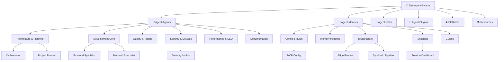

# 🧠 Zoe-Agent-Swarm

> [!abstract] AI Agent Swarm — Hệ thống cộng sinh
> Root node. Toàn bộ vault tổ chức dưới cây này.

---

## 🌳 Vault Tree

```
LPOpenBIMAI/
├── Zoe-Agent-Swarm.md          ← ROOT (bạn đang ở đây)
│
├── 🤖 Agent-Agents/             ← 20 agents, 6 nhóm
│   ├── [[Agent-Agents]]         ← INDEX (6 groups)
│   ├── [[AGENT_SWARM]]          ← Integration 8-layer
│   ├── Agent-Swarm Canvas.md
│   ├── Architecture & Planning/
│   │   ├── [[Orchestrator]]
│   │   ├── [[Project Planner]]
│   │   ├── [[Product Manager]]
│   │   └── [[Product Owner]]
│   ├── Development Core/
│   │   ├── [[Frontend Specialist]]
│   │   ├── [[Backend Specialist]]
│   │   ├── [[Mobile Developer]]
│   │   ├── [[Database Architect]]
│   │   └── [[Game Developer]]
│   ├── Quality & Testing/
│   │   ├── [[Debugger]]
│   │   ├── [[Test Engineer]]
│   │   ├── [[QA Automation Engineer]]
│   │   └── [[Code Archaeologist]]
│   ├── Security & DevOps/
│   │   ├── [[Security Auditor]]
│   │   ├── [[Penetration Tester]]
│   │   └── [[DevOps Engineer]]
│   ├── Performance & SEO/
│   │   ├── [[Performance Optimizer]]
│   │   └── [[SEO Specialist]]
│   └── Documentation & Research/
│       ├── [[Documentation Writer]]
│       └── [[Explorer Agent]]
│
├── 🧠 Agent-Memory/             ← Memory system
│   ├── [[Agent-Memory]]         ← INDEX (5 groups)
│   ├── Config & Rules/
│   │   ├── [[MCP Config]]
│   │   ├── [[GEMINI Rules]]
│   │   └── [[context-rules]], [[memory-config]], [[preferences]]
│   ├── Memory Patterns/
│   │   ├── [[Memory Types trong Agentic Systems]]
│   │   └── [[memory-patterns]], [[memory-decisions]]
│   ├── Infrastructure/
│   │   ├── [[Edge Function v2.2]]
│   │   ├── [[Symbiotic Pipeline]]
│   │   └── [[Memory Context Monitor]], [[Dashboard Guide]]
│   ├── Sessions/
│   │   ├── [[Session Dashboard]]  ← MASTER INDEX
│   │   └── session-YYYY-MM-DD-*.md (dynamic)
│   └── Guides/
│       ├── [[System-Guide]]
│       ├── [[E2E-Guide]], [[Install Guide]]
│       └── [[QUOTA-API-README]]
│
├── 🔧 Agent-Skills/             ← 62 skills, 10 nhóm
│   └── [[Agent-Skills]]         ← INDEX
│
├── 🔌 Agent-Plugins/            ← Obsidian plugins
├── 🌐 Platforms/                ← External platforms
├── 📚 Resources/                ← Reference materials
│
├── Agent-Swarm.canvas           ← Visual flow
├── Memory-Graph.canvas          ← Memory graph visual
└── Vault Dashboard.base         ← Obsidian Base view
```

---

## 🔗 Children

| Folder | Index Note | Nội dung |
|--------|-----------|----------|
| 🤖 Agent-Agents | [[Agent-Agents]] | 20 agents chia 6 nhóm chức năng |
| 🧠 Agent-Memory | [[Agent-Memory]] | Memory system, sessions, infrastructure |
| 🔧 Agent-Skills | [[Agent-Skills]] | 62 skills từ clean-code tới vulnerability-scanner |
| 🔌 Agent-Plugins | — | Obsidian plugins (community + custom) |
| 🌐 Platforms | — | External platforms & integrations |
| 📚 Resources | — | Reference materials, templates |

---

## 📊 System Stats

| Metric | Value |
|--------|-------|
| Agents | 20 (6 groups) |
| Skills | 62 (10 groups) |
| Memory notes | 25+ |
| Sessions | Dynamic (auto-created) |
| MCP Servers | 13 |
| Edge Functions | 1 (mem-gw-final v2.5) |
| Dashboards | 2 (Memory Monitor + Vault Dashboard) |

---

## 🔗 Graph


