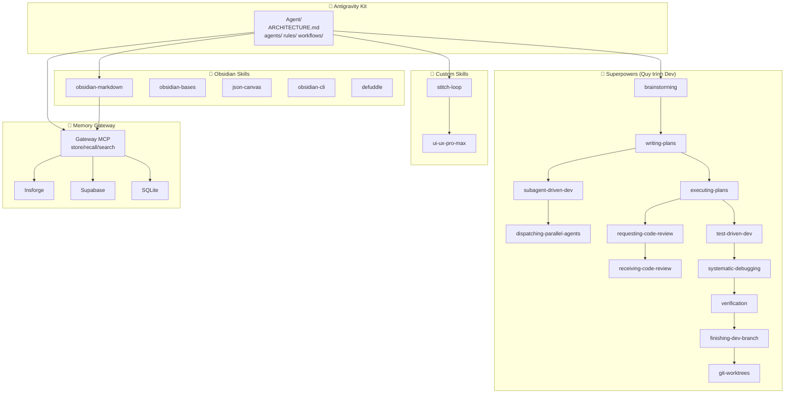

# 🤖 Agent Swarm — Map of Content

> **Antigravity Kit** scaffold + **56 skills** + **Memory Gateway 3 lớp** + **obsidian-mcp**

## Tổng Quan Hệ Thống

## Skill Roster

| # | Skill | Nhóm | Vai trò | Trigger |
|---|-------|------|---------|---------|
| 1 | [[Brainstorming]] | 🧠 | Ý tưởng ban đầu | "brainstorm", "nghĩ idea" |
| 2 | [[Writing Plans]] | 🧠 | Viết plan | "viết plan", "lên kế hoạch" |
| 3 | [[Executing Plans]] | 🧠 | Thực thi plan | "chạy plan" |
| 4 | [[Subagent Driven Dev]] | 🧠 | Chia việc cho subagents | "chia task" |
| 5 | [[Dispatching Parallel Agents]] | 🧠 | Song song hóa | "chạy song song" |
| 6 | [[Requesting Code Review]] | 🧠 | Yêu cầu review | "review code" |
| 7 | [[Receiving Code Review]] | 🧠 | Nhận review | — |
| 8 | [[Test Driven Development]] | 🧠 | TDD | "viết test" |
| 9 | [[Systematic Debugging]] | 🧠 | Debug | "debug", "fix lỗi" |
| 10 | [[Verification]] | 🧠 | Kiểm tra | "verify" |
| 11 | [[Finishing Dev Branch]] | 🧠 | Kết thúc branch | "merge", "PR" |
| 12 | [[Git Worktrees]] | 🧠 | Quản lý worktrees | "worktree" |
| 13 | [[Using Superpowers]] | 🧠 | Hướng dẫn chung | — |
| 14 | [[Writing Skills]] | 🧠 | Viết skill mới | "tạo skill" |
| 15 | [[Obsidian Markdown]] | 📝 | Viết/đọc .md | "viết note" |
| 16 | [[Obsidian Bases]] | 📝 | Tạo views/filters | "tạo view" |
| 17 | [[JSON Canvas]] | 📝 | Tạo canvas | "tạo canvas" |
| 18 | [[Obsidian CLI]] | 📝 | CLI commands | — |
| 19 | [[Defuddle]] | 📝 | Web → markdown | "lấy web" |
| 20 | [[Stitch Loop]] | 🎨 | UI generation | "build UI" |
| 21 | [[UI-UX Pro Max]] | 🎨 | Design system | "design", "UI/UX" |

## Memory Gateway

| Lớp | Backend | Trạng thái |
|-----|---------|-----------|
| Insforge | SQLite + pgvector | 🟢 Primary |
| Supabase | Remote Postgres | 🟡 Backup |
| SQLite | Local `agent.db` | 🟢 Offline |

Config: `Agent/memory/gateway.config.json`

## MCP Servers
| Server | Vai trò |
|--------|--------|
| obsidian-mcp | Read/write notes, search, tags |
| supabase-mcp | Database + Edge Functions |
| github-mcp | Git + PR + Issues |
| firecrawl-mcp | Web scraping + search |
| mcp-server-for-revit | BIM automation |
| stitch-mcp | UI generation |

## 📚 Resources

| # | Note | Nội dung |
|---|------|---------|
| 1 | [[AI Agent Resources]] | System prompts, OpenAI cookbook, LLM apps |
| 2 | [[Prompt & AI Image Library]] | Nano Banana Pro, AI image prompts |
| 3 | [[UI-UX Design Resources]] | Dribbble, Stitch, components, themes |
| 4 | [[Antigravity Kit Resources]] | ag-kit, Superpowers, InsForge |
| 5 | [[Claude Skills Resources]] | Claude skills, best practices |
| 6 | [[SaaS Planning Workflow]] | Production SaaS planning methodology |

## Links
- [[E2E-Guide|📘 Hướng Dẫn E2E]]
- [[Memory-Graph.canvas|🧠 Memory Graph]]
- [[Agent-Swarm.canvas|🗺️ Skill Map]]
- `.agent/ARCHITECTURE.md` — Kiến trúc ag-kit
- `.agent/mcp_config.json` — MCP server config

