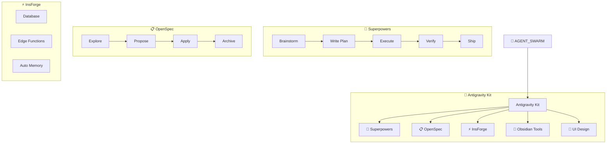

# 🤖 Agent Swarm — Map of Content

> **Antigravity Kit** + **48 skills** + **20 agents** + **Memory Gateway** + **OpenSpec**

## 📂 Index Notes

| Index | Nội dung | Items |
|-------|---------|-------|
| [[Agent-Agents]] | Danh sách 20 specialist agents | 20 agents |
| [[Agent-Skills]] | Danh sách 48 skills | 48 skills |
| [[Agent-Memory]] | Memory system config & sessions | 8 files |
| [[Agent-Plugins]] | Obsidian plugins | 15 plugins |

## Hệ Thống Platform

## 🏗️ Platforms (Hub Navigation)

| # | Platform | Skills | Mô tả |
|---|----------|--------|--------|
| 1 | [[Antigravity Kit]] | 48 + 20 agents | 🚀 Agent scaffold — trung tâm hệ thống |
| 2 | [[Superpowers Hub]] | 13 | 🧠 Dev workflow: brainstorm → plan → execute → ship |
| 3 | [[OpenSpec Hub]] | 4 | 📋 Spec-driven: explore → propose → apply → archive |
| 4 | [[InsForge Hub]] | 4 | ⚡ Backend: DB + Auth + Storage + AI + Functions |
| 5 | [[Obsidian Tools Hub]] | 5 | 📝 Vault: markdown, canvas, CLI, bases |
| 6 | [[UI Design Hub]] | 18 | 🎨 Design + Tech + Security + Quality skills |

## 📊 Skill Roster (48 skills)

### 🧠 Superpowers (Dev Workflow)

| # | Skill | Trigger |
|---|-------|---------|
| 1 | [[Brainstorming]] | "brainstorm", "nghĩ idea" |
| 2 | [[Writing Plans]] | "viết plan" |
| 3 | [[Executing Plans]] | "chạy plan" |
| 4 | [[Subagent Driven Dev]] | "chia task" |
| 5 | [[Dispatching Parallel Agents]] | "chạy song song" |
| 6 | [[Requesting Code Review]] | "review code" |
| 7 | [[Receiving Code Review]] | — |
| 8 | [[Test Driven Development]] | "viết test" |
| 9 | [[TDD Workflow]] | "TDD" |
| 10 | [[Systematic Debugging]] | "debug", "fix lỗi" |
| 11 | [[Verification]] | "verify" |
| 12 | [[Finishing Dev Branch]] | "merge", "PR" |
| 13 | [[Git Worktrees]] | "worktree" |

### 📋 OpenSpec (Spec-Driven)

| # | Skill | Command |
|---|-------|---------|
| 14 | [[openspec-explore]] | `/opsx:explore` |
| 15 | [[openspec-propose]] | `/opsx:propose` |
| 16 | [[openspec-apply-change]] | `/opsx:apply` |
| 17 | [[openspec-archive-change]] | `/opsx:archive` |

### 📝 Obsidian Tools

| # | Skill | Trigger |
|---|-------|---------|
| 18 | [[Obsidian Markdown]] | "viết note" |
| 19 | [[Obsidian Bases]] | "tạo view" |
| 20 | [[JSON Canvas]] | "tạo canvas" |
| 21 | [[Obsidian CLI]] | — |
| 22 | [[Defuddle]] | "lấy web" |

### 🎨 Design & Frontend

| # | Skill | Trigger |
|---|-------|---------|
| 23 | [[UI-UX Pro Max]] | "design", "UI/UX" |
| 24 | [[Stitch Loop]] | "build UI" |
| 25 | [[Frontend Design]] | "thiết kế web" |
| 26 | [[Mobile Design]] | "thiết kế mobile" |
| 27 | [[Tailwind Patterns]] | "tailwind" |
| 28 | [[React Best Practices]] | "react", "next.js" |

### ⚙️ Backend & Infra

| # | Skill | Trigger |
|---|-------|---------|
| 29 | [[Auto Memory]] | auto |
| 30 | [[Database Design]] | "database" |
| 31 | [[API Patterns]] | "API" |
| 32 | [[Node.js Best Practices]] | "node" |
| 33 | [[Python Patterns]] | "python" |
| 34 | [[Rust Pro]] | "rust" |
| 35 | [[MCP Builder]] | "MCP" |
| 36 | [[Server Management]] | "server" |
| 37 | [[Deployment Procedures]] | "deploy" |

### 🛡️ Security & Quality

| # | Skill | Trigger |
|---|-------|---------|
| 38 | [[Vulnerability Scanner]] | "security scan" |
| 39 | [[Red Team Tactics]] | "red team" |
| 40 | [[Testing Patterns]] | "testing" |
| 41 | [[Webapp Testing]] | "E2E test" |
| 42 | [[Performance Profiling]] | "performance" |
| 43 | [[Code Review Checklist]] | "checklist" |

### 📖 Meta Skills

| # | Skill | Trigger |
|---|-------|---------|
| 44 | [[Using Superpowers]] | — |
| 45 | [[Writing Skills]] | "tạo skill" |
| 46 | [[Behavioral Modes]] | — |
| 47 | [[Clean Code]] | — |
| 48 | [[Game Development]] | "game" |

## Memory Gateway

| Lớp | Backend | Trạng thái |
|-----|---------|-----------| 
| InsForge | PostgreSQL + Edge Functions | 🟢 Primary |
| Supabase | Remote Postgres | 🟡 Backup |
| SQLite | Local `agent.db` | 🟢 Offline |

## MCP Servers

| Server | Vai trò |
|--------|--------|
| obsidian-mcp | Read/write notes, search, tags |
| supabase-mcp | Database + Edge Functions |
| github-mcp | Git + PR + Issues |
| firecrawl-mcp | Web scraping + search |
| mcp-server-for-revit | BIM automation |
| stitch-mcp | UI generation |

## 📚 Resources

| # | Note | Nội dung |
|---|------|---------|
| 1 | [[AI Agent Resources]] | System prompts, OpenAI cookbook, LLM apps |
| 2 | [[Prompt & AI Image Library]] | Nano Banana Pro, AI image prompts |
| 3 | [[UI-UX Design Resources]] | Dribbble, Stitch, components, themes |
| 4 | [[Antigravity Kit Resources]] | ag-kit, Superpowers, InsForge repos |
| 5 | [[Claude Skills Resources]] | Claude skills, best practices |
| 6 | [[SaaS Planning Workflow]] | Production SaaS methodology |
| 7 | [[OpenSpec Integration]] | CLI reference & setup guide |

## Links

- [[Agent-Agents|🤖 Agents Index]] — 20 specialist agents
- [[Agent-Skills|🧩 Skills Index]] — 48 skills
- [[Agent-Memory|🧠 Memory Index]] — Memory system
- [[Agent-Plugins|🔌 Plugins Index]] — 15 plugins
- [[E2E-Guide|📘 Hướng Dẫn E2E]]
- [[Memory-Graph.canvas|🧠 Memory Graph]]
- [[Agent-Swarm.canvas|🗺️ Skill Map]]
- `.agent/ARCHITECTURE.md` — Kiến trúc ag-kit
- `.agent/mcp_config.json` — MCP server config
