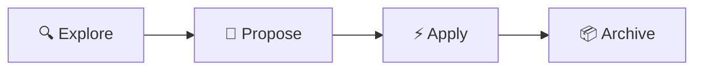

# 📋 OpenSpec — Spec-Driven Development

> Agree before you build — [github.com/Fission-AI/OpenSpec](https://github.com/Fission-AI/OpenSpec)

## Workflow



## Slash Commands

| Command | Skill | Mô tả |
|---------|-------|--------|
| `/opsx:explore` | [[openspec-explore]] | Khảo sát, suy nghĩ |
| `/opsx:propose` | [[openspec-propose]] | Tạo proposal + design + tasks |
| `/opsx:apply` | [[openspec-apply-change]] | Implement tasks |
| `/opsx:archive` | [[openspec-archive-change]] | Archive change |

## Artifacts Per Change

```
openspec/changes/<name>/
├── proposal.md   ← What & Why
├── design.md     ← How  
└── tasks.md      ← Implementation steps
```

## Mapping → Superpowers

| OpenSpec | → | Superpowers |
|---------|---|-------------|
| Explore | → | [[Brainstorming]] |
| Propose | → | [[Writing Plans]] |
| Apply | → | [[Executing Plans]] |
| Archive | → | [[Finishing Dev Branch]] |

## Links

- [[Antigravity Kit|← Antigravity Kit]]
- [[AGENT_SWARM|← Agent Swarm MOC]]
- [[OpenSpec Integration]] — CLI reference & setup
