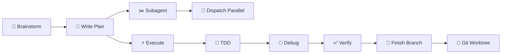

# 🧠 Superpowers — Dev Workflow Skills

> Quy trình phát triển từ ý tưởng → ship — [github.com/obra/superpowers](https://github.com/obra/superpowers)

## Workflow Pipeline

## Skills (13)

| # | Skill | Phase | Trigger |
|---|-------|-------|---------|
| 1 | [[Brainstorming]] | 💡 Ideation | "brainstorm", "nghĩ idea" |
| 2 | [[Writing Plans]] | 📝 Planning | "viết plan" |
| 3 | [[Executing Plans]] | ⚡ Execution | "chạy plan" |
| 4 | [[Subagent Driven Dev]] | ✂️ Split | "chia task" |
| 5 | [[Dispatching Parallel Agents]] | 🔀 Parallel | "chạy song song" |
| 6 | [[Requesting Code Review]] | 👀 Review | "review code" |
| 7 | [[Receiving Code Review]] | ✅ Review | — |
| 8 | [[Test Driven Development]] | 🧪 Test | "viết test" |
| 9 | [[TDD Workflow]] | 🧪 Test | "TDD" |
| 10 | [[Systematic Debugging]] | 🐛 Debug | "debug", "fix lỗi" |
| 11 | [[Verification]] | ✅ Verify | "verify" |
| 12 | [[Finishing Dev Branch]] | 🚀 Ship | "merge", "PR" |
| 13 | [[Git Worktrees]] | 🌳 Isolate | "worktree" |

## Meta Skills

| Skill | Mô tả |
|-------|--------|
| [[Using Superpowers]] | Hướng dẫn chung |
| [[Writing Skills]] | Tạo skill mới |
| [[Behavioral Modes]] | AI modes (brainstorm, debug, review...) |
| [[Clean Code]] | Coding standards |

## Links

- [[Antigravity Kit|← Antigravity Kit]]
- [[AGENT_SWARM|← Agent Swarm MOC]]
