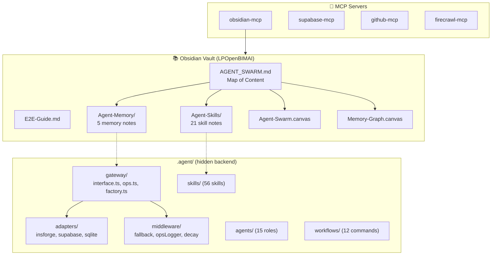
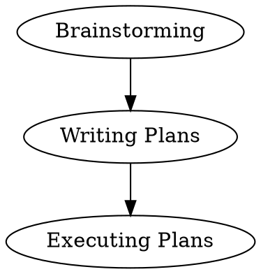

---
title: "Hướng Dẫn Hệ Thống Agent Swarm + Obsidian"
tags:
  - guide
  - agent
  - system
aliases:
  - System Guide
---

# 🗺️ Hướng Dẫn Hệ Thống Agent Swarm + Obsidian

## 1. Kiến Trúc Tổng Quan



---

## 2. Checklist — Đã Đưa Vào Obsidian?

### ✅ Đã có trong vault (visible cho Graph View)

| Thành phần | Vị trí | Số lượng |
|-----------|--------|----------|
| MOC (Map of Content) | `AGENT_SWARM.md` | 1 |
| E2E Guide | `E2E-Guide.md` | 1 |
| System Guide | `System-Guide.md` | 1 (file này) |
| Skill Notes | `Agent-Skills/` | 21 notes |
| Memory Notes | `Agent-Memory/` | 5 notes |
| Skill Map Canvas | `Agent-Swarm.canvas` | 1 |
| Memory Map Canvas | `Memory-Graph.canvas` | 1 |

### ✅ Backend code (hidden `.agent/` — ag-kit convention)

| Thành phần | Vị trí |
|-----------|--------|
| Memory Gateway (TypeScript) | `.agent/memory/gateway/` |
| Gateway Config | `.agent/memory/gateway.config.json` |
| 56 Skills | `.agent/skills/` |
| Agents | `.agent/agents/` |
| Workflows | `.agent/workflows/` |
| MCP Config | `.agent/mcp_config.json` |

### ✅ MCP Servers (Gemini config)

| Server | File | Status |
|--------|------|--------|
| obsidian-mcp | `~/.gemini/antigravity/mcp_config.json` | ✅ Configured |
| supabase-mcp | same | ✅ Active |
| github-mcp | same | ✅ Active |
| firecrawl-mcp | same | ✅ Active |

> [!important]
> **Restart Antigravity** sau khi thêm MCP server mới để activate.

---

## 3. 15 Plugins — Cách Sử Dụng Tích Hợp

### 🔍 Nhóm Graph & Visualization

#### [[3D Graph|3D Graph]] `3d-graph`
- **Mở:** Ctrl+P → "3D Graph"
- **Tác dụng:** Xem toàn bộ vault dạng 3D xoay được
- **Với Agent Swarm:** Nhìn thấy cụm skill notes kết nối qua wikilinks

#### [[Graphs|Graphs]] `graphs`
- **Mở:** Ctrl+P → "Graphs" → "Open Graphs View"
- **Tác dụng:** Enhanced graph view với filters, colors theo tags
- **Với Agent Swarm:** Filter theo tag `skill`, `memory`, `agent` để xem từng layer

#### [[Graph Analysis|Graph Analysis]] `graph-analysis`
- **Mở:** Ctrl+P → "Graph Analysis"
- **Tác dụng:** Phân tích centrality, clustering, shortest path
- **Với Agent Swarm:** Tìm skill nào là hub (nhiều connection nhất)

#### [[Graphviz|Graphviz]] `obsidian-graphviz`
- **Syntax trong note:**
````

````
- **Với Agent Swarm:** Vẽ workflow diagrams trực tiếp trong notes

#### [[Lovely Mindmap|Lovely Mindmap]] `lovely-mindmap`
- **Mở:** Ctrl+P → "Lovely Mindmap" trên bất kỳ note nào
- **Tác dụng:** Chuyển heading structure → mindmap visual
- **Với Agent Swarm:** Mở `AGENT_SWARM.md` → mindmap = overview toàn hệ thống

---

### 📝 Nhóm Editing & Formatting

#### [[Smart Typography|Smart Typography]] `obsidian-smart-typography`
- **Tự động:** Chuyển `"text"` → "text", `--` → —, `...` → …
- **Với Agent Swarm:** Format đẹp cho memory notes, documentation

#### [[Autocorrect Formatter|Autocorrect Formatter]] `autocorrect-formatter`
- **Tự động:** Sửa lỗi chính tả, format text
- **Config:** Settings → Autocorrect Formatter

#### [[Advanced Cursors|Advanced Cursors]] `advanced-cursors`
- **Hotkey:** Alt+Click = multiple cursors, Ctrl+D = select next occurrence
- **Với Agent Swarm:** Bulk edit frontmatter tags across skill notes

#### [[Always Color Text|Always Color Text]] `always-color-text`
- **Syntax:** `<font color="red">text</font>` hoặc dùng toolbar
- **Với Agent Swarm:** Color-code priority levels trong memory notes

#### [[Ordered List Style|Ordered List Style]] `list-style`
- **Tác dụng:** Custom numbering (a, b, c / i, ii, iii / roman)
- **Syntax:** Thêm `cssclasses: list-style-alpha` vào frontmatter

---

### 🔗 Nhóm Content & Integration

#### [[File Include|File Include]] `file-include`
- **Syntax:** `![[file.md]]` nhưng mạnh hơn, include partial
- **Với Agent Swarm:** Include snippet từ skill notes vào MOC

#### [[Simple CanvaSearch|Simple CanvaSearch]] `simple-canvasearch`
- **Mở:** Ctrl+P → "CanvaSearch" khi đang ở canvas
- **Với Agent Swarm:** Tìm node trong `Agent-Swarm.canvas` (33 nodes)

#### [[Dialogue|Dialogue Plugin]] `obsidian-dialogue-plugin`
- **Syntax:**
```
```dialogue
left: Agent
right: User

l: Tôi sẽ phân tích yêu cầu của bạn
r: Ok, hãy bắt đầu
```  
- **Với Agent Swarm:** Ghi lại conversations với AI trong memory notes

#### [[Full Calendar|Full Calendar]] `obsidian-full-calendar`
- **Mở:** Ctrl+P → "Full Calendar: Open"
- **Với Agent Swarm:** Track project timelines, memory decay schedules

#### [[Pane Relief|Pane Relief]] `pane-relief`
- **Hotkeys:** Ctrl+Alt+← → = per-tab history
- **Với Agent Swarm:** Navigate nhanh giữa skill notes ↔ MOC ↔ canvas

---

## 4. Workflow Hàng Ngày

### Bắt đầu session
1. Mở Obsidian → `AGENT_SWARM.md` (MOC)
2. Ctrl+G → Graph View (hoặc 3D Graph)
3. Xem skill connections, click vào skill cần dùng

### Làm việc với project
1. Tạo note mới trong `Agent-Memory/` cho project context
2. Link tới skills: `[[Brainstorming]]` → `[[Writing Plans]]` → `[[Executing Plans]]`  
3. Memory Gateway tự động store/recall context

### Review kiến trúc
1. Mở `Agent-Swarm.canvas` → visual skill map
2. Mở `Memory-Graph.canvas` → memory architecture
3. Dùng Simple CanvaSearch để filter nodes

### Visualize
1. Lovely Mindmap trên `AGENT_SWARM.md` → system overview
2. Graph Analysis → tìm central skills
3. 3D Graph → spatial view toàn vault

---

## 5. Quick Reference

| Muốn làm gì           | Plugin/Tool                      |
| --------------------- | -------------------------------- |
| Xem graph 2D          | Ctrl+G (built-in) hoặc `graphs`  |
| Xem graph 3D          | `3d-graph`                       |
| Phân tích graph       | `graph-analysis`                 |
| Vẽ diagram trong note | `obsidian-graphviz` (dot syntax) |
| Mindmap từ note       | `lovely-mindmap`                 |
| Tìm trong canvas      | `simple-canvasearch`             |
| Ghi hội thoại         | `obsidian-dialogue-plugin`       |
| Lịch dự án            | `obsidian-full-calendar`         |
| Navigate nhanh        | `pane-relief` (Ctrl+Alt+←→)      |
| AI đọc/ghi vault      | obsidian-mcp (MCP server)        |

---

> [!tip] Pro Tip
> Mở **Graph View** (Ctrl+G), pin bên phải. Khi click vào bất kỳ note nào ở **Agent-Skills/**, graph sẽ highlight connections — cho thấy skill đó liên kết tới skills nào, flows như nào.
